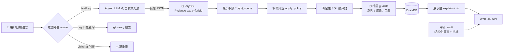

# FutureBI — 企业级 ChatBI（Data Agent）基础底座

<p align="center">
  <b>规格驱动（Spec-Driven）：自然语言 → 结构化 DSL(JSON) → 确定性 SQL 编译器 → DuckDB 执行</b><br/>
  LLM 只产出受控 JSON，绝不直接生成裸 SQL —— 从机制上杜绝幻觉与注入。
</p>

<p align="center">
  
  
  
  
  
</p>

---

## 目录

- [1. 架构总览](#1-架构总览)
- [2. 技术栈](#2-技术栈)
- [3. 核心设计约束](#3-核心设计约束)
- [4. 工程目录结构](#4-工程目录结构)
- [5. 快速开始](#5-快速开始)
- [6. 全链路能力说明](#6-全链路能力说明)
- [7. 演进里程碑](#7-演进里程碑)
- [8. 环境变量配置](#8-环境变量配置)
- [9. Web UI 与 API](#9-web-ui-与-api)
- [10. 安全模型](#10-安全模型)
- [11. 质量保障](#11-质量保障)
- [12. 相关文档](#12-相关文档)
- [13. 许可证](#13-许可证)

---

## 1. 架构总览



> [!NOTE]
> **设计主线**：LLM 只负责把自然语言翻译成契约内的 DSL（JSON），SQL 只能由确定性编译器产出，字段必须登记在语义目录（`semantic/catalog.py`）的白名单中，Join 仅允许星型模型的受控连接。任何一步失败都拒绝回答（`PipelineError`），绝不猜测、绝不裸 SQL。

## 2. 技术栈

| 组件 | 选型 | 用途 |
| --- | --- | --- |
| 语言 | Python 3.11+（锁定 3.12） | 全链路 |
| 数据校验 | Pydantic V2（严格类型标注 + `extra="forbid"`） | DSL 契约 |
| 本地数仓 | DuckDB | 开发 / 评测 / 单测零成本 |
| 评测 | Golden Dataset（19 用例）+ pytest | 确定性回归 |
| 代码质量 | black + ruff + pytest | 提交前门禁（CI） |
| Web | 标准库 `http.server` + 原生 SVG（零前端框架） | 可视化 UI |

## 3. 核心设计约束

- **受限 DSL**：所有模型 `extra="forbid"`，字段 / 操作符 / 聚合函数均为受限枚举，Agent 只能产出契约内字段；
- **确定性编译**：SQL 由编译器单向生成，DSL 与 SQL 一一对应，可审计、可解释；
- **受控 Join**：仅允许星型模型的 1:1 / 多:1 受控连接（`FACT_JOIN_RULES`），业务上杜绝扇出放大；
- **最小权限**：权限在生成前注入（scope），生成后再经 `apply_policy` 纵深防御；
- **资源治理**：超时看门狗取消、扫描行数预检熔断、LIMIT 硬上限，拒绝病态查询；
- **自愈闭环**：编译 / 引擎精确报错喂回 LLM 重写 DSL（至少 1 次），确定性兜底模式透传原始报错。

> [!TIP]
> 想让 LLM 真正上线工作？配置 `LLM_API_KEY` 即可从「启发式兜底」无缝切换为「LLM 路径」；未配置时全链路离线可跑（golden 双模式 19/19）。

## 4. 工程目录结构

```text
FutureBI/
├── README.md                   # 本文档
├── AGENTS.md                   # 面向 AI 协作的工程约定
├── PRODUCTION_READINESS_AUDIT.md  # 生产就绪度评审报告
├── pyproject.toml              # 项目元数据 + pytest/black/ruff 配置
├── requirements.txt            # 运行依赖
├── requirements-dev.txt        # 开发依赖（pytest/black/ruff）
├── .env.example                # 环境变量模板（密钥不入库）
├── config/
│   └── settings.py             # 项目根、DB 路径、评测锚点、全部可配置项
├── semantic/                   # 语义层（Single Source of Truth）
│   ├── dsl_schema.py           # 受限查询 DSL（Pydantic V2）
│   └── catalog.py              # 逻辑字段 -> 物理表/列 受控映射
├── agent/                      # NL -> DSL Agent 编排
│   ├── pipeline.py             # run_pipeline(query, principal) 统一入口
│   ├── agent.py                # LLMNL2DSL：JSON + 严格校验 + 失败重试
│   ├── heuristic.py            # 确定性启发式兜底（离线可跑）
│   ├── router.py               # 意图路由三分类（text2sql/rag/chitchat）
│   ├── rag.py / glossary.py    # 口径文档检索（别名 + bigram 打分）
│   ├── clarify.py / slotfill.py # 语义澄清反问 + 多轮槽位回填
│   ├── intent.py               # 意图枚举
│   ├── llm.py                  # OpenAI 兼容客户端（纯标准库）
│   ├── prompts.py              # Prompt 模板（含主体可见字段白名单注入）
│   └── errors.py               # PipelineError（拒绝而非猜测）
├── compiler/
│   └── sql_compiler.py         # QueryDSL -> 确定性 DuckDB SQL
├── exec/
│   └── guards.py               # 执行层资源治理：超时取消 / 扫描行熔断 / LIMIT 硬上限 / 只读白名单 / 自愈支持
├── eval/
│   ├── golden_dataset.json     # 19 个标准问答对（覆盖 19 类场景）
│   └── eval_runner.py          # 自动评测（oracle / agent 双模式）
├── mock/
│   ├── init_duckdb.py          # 建库 + 灌数据（固定种子 42，可复现）
│   └── metadata.py             # 字段中文业务注释
├── present/
│   ├── explain.py              # DSL -> 中文业务话术
│   ├── viz.py                  # 可视化推荐（number/line/bar/pie/table）
│   └── labels.py               # 中文标签映射
├── security/
│   ├── policy.py               # 不可变 Policy + admin/analyst/restricted
│   ├── guard.py                # apply_policy 权限守卫
│   └── scope.py                # 生成前最小权限字段/表作用域
├── auth/
│   ├── identity.py             # 身份库（PBKDF2-SHA256 口令哈希）
│   ├── tokens.py               # HS256 JWT 纯标准库实现
│   ├── session.py              # 会话存储（进程内 / SQLite 共享）
│   ├── gateway.py              # authenticate(headers) -> principal
│   └── ratelimit.py            # 登录失败限流（指数退避）
├── audit/
│   ├── record.py               # 单次问答审计快照
│   ├── store.py                # 审计落盘（多写者文件锁）
│   ├── logging.py              # 结构化日志（request_id 贯穿）
│   └── metrics.py              # QPS / P50/P95 / 意图分布 / 自愈成功率
├── web/
│   ├── service.py              # run_query 全链路服务（DSL/SQL/结果/解释/viz/审计/指标）
│   ├── server.py               # HTTP 服务（鉴权网关 + REST API + 静态页）
│   └── static/                 # 单页前端（SVG 图表 + 数据表 + 登录态）
├── tools/
│   └── mock_llm_server.py      # 本地 OpenAI 兼容 Chat Completions 模拟服务
└── tests/                      # 17 个测试文件（159 用例）
    ├── conftest.py             # 内存 DuckDB fixture
    ├── test_schema.py          # DSL 契约测试
    ├── test_compiler.py        # 编译器测试
    ├── test_eval.py            # Golden 端到端评测
    ├── test_security.py        # 权限（表/列/RLS）
    ├── test_scope.py           # 生成前作用域
    ├── test_router.py          # 意图路由与澄清
    ├── test_slotfill.py        # 多轮槽位回填
    ├── test_agent.py           # Agent 双路径与自愈
    ├── test_exec.py            # 执行层资源治理
    ├── test_audit.py           # 审计快照与落盘
    ├── test_metrics.py         # 可观测性指标
    ├── test_present.py         # 解释与可视化
    ├── test_auth.py            # 认证 / 会话 / 令牌
    ├── test_ratelimit.py       # 登录限流
    ├── test_web.py             # Web 服务
    └── test_web_auth.py        # Web 鉴权网关
```

## 5. 快速开始

### 5.1 环境

项目使用 conda 专用虚拟环境 `futurebi`（Python 3.12）：

```bash
conda create -n futurebi python=3.12 -y
conda activate futurebi
pip install -r requirements-dev.txt
```

### 5.2 一键跑通

```bash
# 1) 初始化本地数仓（生成 analytics_sandbox.duckdb，幂等）
python -m mock.init_duckdb

# 2) 跑 Golden 评测（连接文件库）
python -m eval.eval_runner                  # oracle：golden 标准答案（自闭环）
python -m eval.eval_runner --pipeline agent # 真实 Agent（无 Key 时启发式兜底）
python -m eval.eval_runner --print-sql      # 额外打印编译 SQL

# 3) 跑单测（内存库，不依赖文件）
python -m pytest -q

# 4) 启动 Web 可视化 UI（默认 8000）
python -m web.server 8000
# 浏览器打开 http://127.0.0.1:8000
```

> [!WARNING]
> 提交前请确保 `black --check .`、`ruff check .`、`python -m pytest -q` 全绿 —— CI 门禁与本地一致。

## 6. 全链路能力说明

### 6.1 语义 DSL（`semantic/dsl_schema.py`）

- `metrics`：度量列表，含 `aggregate`（sum/count/count_distinct/avg/min/max）与 `ratio`（如 ARPU = GMV / 去重用户数）；
- `dimensions`：切片维度（channel/category/province 等）；
- `time_filter`：结构化时间过滤，含 `granularity`（day/week/month）、相对/绝对时间跨度、同比/环比标记 `comparison`；
- `filters`：通用过滤（eq/in/gt/lt/between）；
- `order_by` / `limit`：排序与截断（默认安全值 100）；
- 进阶语义：`WindowMetric`（cumsum/moving_avg）、`fill_gaps` 日期补零、`TopN` 分组过滤。

### 6.2 NL -> DSL（`agent/`）

| 路径 | 实现 | 触发条件 |
| --- | --- | --- |
| LLM Agent | `agent/agent.py` LLMNL2DSL：LLM 产出 JSON → `QueryDSL.model_validate` 严格校验 → 失败反馈重试（零幻觉） | 配置 `LLM_API_KEY` |
| 启发式兜底 | `agent/heuristic.py` DeterministicNL2DSL：规则化 NL -> DSL，覆盖 golden 高频问法 | 未配置 API Key（离线可跑） |

**意图路由**（`agent/router.py`，生成 DSL 之前）：`text2sql`（数据分析）→ 链路；`rag`（口径询问）→ `glossary.py` 检索；`chitchat`（闲聊/越界）→ 礼貌拒绝。对 text2sql 缺失时间窗口或未定义业务指标时返回 `clarify` 澄清反问，**绝不静默回退默认值**；多轮澄清的短语答案由 `slotfill.py` 合并回原问题再执行。

### 6.3 确定性编译（`compiler/sql_compiler.py`）

DSL → 单一确定性 DuckDB SQL；支持同比/环比双窗口 CTE、窗口函数（cumsum/moving_avg）、`generate_series` 日期补零、`ROW_NUMBER` 分组 Top-N；对 comparison / top_n / fill_gaps / window 的互斥组合显式抛 `CompileError`。

### 6.4 执行层资源治理（`exec/guards.py`）

| 机制 | 实现 |
| --- | --- |
| 语句超时 | 线程看门狗 + `conn.interrupt()` 取消，超时抛 `QueryTimeoutError` |
| 扫描行数熔断 | `EXPLAIN ANALYZE` 预检基表扫描行数，超限抛 `MaxRowsScannedExceeded` |
| 返回行数硬上限 | 独立 `max_result_rows` 防御性熔断（`ResultLimitExceeded`） |
| 只读 SQL 白名单 | 剥离注释/字面量后校验，拒绝非只读语句（`UnsafeSqlError`） |
| 自愈重写 | 编译/引擎精确报错喂回 LLM 重写 DSL（`SQL_SELF_HEAL_MAX_RETRIES` ≥ 1 次） |

### 6.5 展示层（`present/`）

- `explain(dsl)`：把指标/维度/过滤/时间/排序/limit 翻译成一句中文业务话术；
- `recommend_viz(dsl, columns, rows)`：按结果形状推荐 number/line/bar/pie/table，输出前端可用的 x/y 配置。

```python
from agent.pipeline import run_pipeline
from present.explain import explain

dsl = run_pipeline("各品类成功订单的GMV分布？")
print(explain(dsl))
# 查询指标：gmv（求和订单金额），按 类目 分组，筛选条件：支付状态 等于 成功，最多返回 100 条。
```

### 6.6 审计与可观测性（`audit/`）

每次问答落盘完整可追溯快照（request_id / 用户 / prompt / DSL / SQL / 耗时 / 行数 / 自愈次数 / 错误），并打点进程内指标（QPS、P50/P95、意图/动作分布、自愈成功率、熔断次数、澄清触发率、降级次数），经 `GET /api/metrics` 暴露。

## 7. 演进里程碑

| 期次 | 能力 | 状态 |
| --- | --- | --- |
| 一期 | 语义 DSL + Mock 数仓 + Golden 评测骨架 | ✅ |
| 二期 | LLM Agent 与启发式兜底双路径（`run_pipeline`） | ✅ |
| 三期 | 同比/环比（`TimeFilter.comparison` 双窗口 CTE） | ✅ |
| 四期 | 多事实表语义模型（`fact_refunds` 1:1 LEFT JOIN、跨表比率指标） | ✅ |
| 五期 | 权限控制：表级 / 列级 / 行级 RLS（`security/`） | ✅ |
| 六期 | 展示层：DSL 解释 + 可视化推荐（`present/`） | ✅ |
| 七期 | Web 可视化 UI（NL -> DSL -> SQL -> 结果 -> 解释 + 图表） | ✅ |
| 八期 | 进阶语义：多指标同环比 / 窗口函数 / 日期补零 / 分组 Top-N | ✅ |
| 九期 | 意图路由三分类 + 语义澄清反问（`router.py`） | ✅ |
| 十期 | 统一身份认证 + 服务端强制绑定 principal + 守卫前移（`auth/` + `security/scope.py`） | ✅ |
| 十一期 | 执行层资源治理与自愈（`exec/guards.py`）+ 审计埋点与结构化日志（`audit/`） | ✅ |
| 十二期 | 生产就绪加固：标识符注入防御 / 只读 SQL 白名单 / 登录限流 / 会话 SQLite 持久化 / 启动强校验 / 可观测性指标 | ✅ |

> [!NOTE]
> 各期详细设计说明见本仓库 Git 历史（`feat(…)` 提交）与 `PRODUCTION_READINESS_AUDIT.md` 评审报告。

## 8. 环境变量配置

从模板创建本地配置（密钥不入库）：

```bash
copy .env.example .env   # 然后编辑 .env 填入密钥与端点
```

| 分组 | 变量 | 说明 |
| --- | --- | --- |
| LLM | `LLM_API_KEY` / `LLM_BASE_URL` / `LLM_MODEL` / `LLM_TEMPERATURE` / `LLM_TIMEOUT` / `LLM_MAX_RETRIES` | OpenAI 兼容端点（OpenAI / DeepSeek / Kimi / vLLM / Ollama 均可） |
| 执行层 | `QUERY_TIMEOUT_MS` / `MAX_SCAN_ROWS` / `MAX_RESULT_ROWS` / `SQL_SELF_HEAL_MAX_RETRIES` | 超时 / 熔断 / 自愈 |
| 澄清 | `CLARIFY_SLOT_TTL` | 多轮澄清槽位合并窗口（秒） |
| 审计 | `AUDIT_ENABLED` / `LOG_LEVEL` | 审计与结构化日志 |
| 认证 | `AUTH_ENABLED` / `AUTH_STRICT` / `WEB_HOST` / `AUTH_DEFAULT_*` / `AUTH_JWT_*` / `AUTH_LOGIN_*` / `AUTH_SESSION_DB` | 鉴权网关（会话可落盘 SQLite） |

- 项目启动时 `config/settings.py` 自动加载根目录 `.env`（`python-dotenv`）；
- 环境变量优先级高于 `.env` 文件，便于 CI / 容器注入真实密钥；
- 生产环境务必替换 `AUTH_JWT_SECRET`；严格模式（`AUTH_STRICT=1` 或绑定非 localhost）拒绝弱默认密钥与关闭鉴权。

## 9. Web UI 与 API

### 9.1 API 端点

| 端点 | 方法 | 说明 |
| --- | --- | --- |
| `/api/health` | GET | 健康检查 |
| `/api/metrics` | GET | 可观测性指标（QPS / 分位数 / 分布） |
| `/api/auth/login` | POST | 用户名 / 口令 -> JWT + 会话 + `Set-Cookie` |
| `/api/auth/logout` | POST | 吊销服务端会话 |
| `/api/auth/me` | GET | 返回当前身份（未登录 401） |
| `/api/query` | POST | 受保护查询：`{dsl, sql, columns, rows, explanation, viz}`；请求体中的 `principal` 一律忽略 |
| `/static/` | GET | 单页前端 |

### 9.2 查询示例

```bash
# 1) 登录换取 JWT（内置演示账号 analyst/analyst123）
curl -X POST http://127.0.0.1:8000/api/auth/login \
  -H "Content-Type: application/json" \
  -d '{"username":"analyst","password":"analyst123"}'

# 2) 携带 Bearer 令牌查询
curl -X POST http://127.0.0.1:8000/api/query \
  -H "Content-Type: application/json" \
  -H "Authorization: Bearer <token>" \
  -d '{"query":"各品类成功订单的GMV分布？"}'
```

### 9.3 离线自检（无需真实 Key）

```bash
python tools/mock_llm_server.py 8765          # 终端 A：本地 OpenAI 兼容模拟端点
# 终端 B（指向模拟端点）：
set LLM_API_KEY=sk-mock & set LLM_BASE_URL=http://127.0.0.1:8765/v1 & set LLM_MODEL=mock
python -c "from agent.pipeline import run_pipeline; print(run_pipeline('2024年6月GMV多少').model_dump_json())"
```

验证 LLM 路径是否生效：

```bash
python -c "from agent.pipeline import _default_agent; print(type(_default_agent()).__name__)"
# LLMNL2DSL = 已启用 LLM；DeterministicNL2DSL = 启发式兜底
```

## 10. 安全模型

- **统一身份认证**（`auth/`）：口令 PBKDF2-SHA256 哈希 + 恒定时间比对；HS256 JWT 纯标准库（签名/exp/iss/aud/nbf 全校验），令牌只携带 `sub`，**绝不携带 principal/role**；服务端每次请求把身份重新映射为 principal，角色变更即时生效；
- **会话**：JWT 与 Session 双通道；`AUTH_SESSION_DB` 配置 SQLite 后会话落盘（重启不丢、多 worker 共享）；登录失败按 用户名+IP 指数退避限流；
- **守卫前移**：`security/scope.py` 把主体可见字段/表白名单注入 Prompt，越权字段根本不进入模型视野；生成后 `apply_policy` 作第二道纵深防御（表级 ⊆ / 列级 ∉ / 行级 RLS 强制注入）；
- **不变式**：`AUTH_ENABLED=0` 时也不信任客户端，回退到服务端默认身份（`AUTH_DEFAULT_*`）—— **principal 永远由服务端决定**。

内置演示账号：

| 账号 | 口令 | 权限 |
| --- | --- | --- |
| `admin` | `admin123` | 全表 |
| `analyst` | `analyst123` | 全表仅 5 省 RLS |
| `bob` | `bob123` | restricted：无退款表 / 无敏感列 / 仅广东 |

## 11. 质量保障

- **Golden 评测**：`golden_dataset.json` 19 个覆盖不同场景的高频问答对（单/多指标聚合、维度拆分、相对时间、多过滤组合、Top N、时间趋势、计数、去重、ARPU、in/between、多指标同环比、窗口累计/移动平均、日期补零、分组 Top-N）；对每个用例断言 DSL 与预期一致、编译 SQL 执行结果一致（含 sha256 结果哈希）；oracle 与 agent 双模式 **19/19**；
- **单测**：17 个测试文件共 **159 用例**全绿（内存 DuckDB，不依赖文件库）；
- **静态门禁**：`black --check .`（64 文件 clean）、`ruff check .`（clean）；
- **CI**（`.github/workflows/ci.yml`）：push / PR 跑 lint + 全量测试 + golden 双模式；每日凌晨夜跑全量测试 + RLS 对抗矩阵，防回归漏网；
- **可复现**：评测锚点 `AS_OF_DATE = 2024-06-30`、随机种子 42。

## 12. 相关文档

- [AGENTS.md](./AGENTS.md) —— 面向 AI 协作的工程约定（环境 / 命令 / 目录 / 关键约定）
- [PRODUCTION_READINESS_AUDIT.md](./PRODUCTION_READINESS_AUDIT.md) —— 生产就绪度评审报告（80/100，P0 整改项）
- [.env.example](./.env.example) —— 环境变量模板

## 13. 许可证

[MIT](./LICENSE) © 2026 FutureBI contributors
