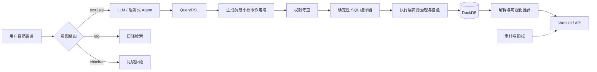

# 架构与设计

## 架构总览

## 核心原则

- **受限生成**：LLM 只输出契约内 JSON；Pydantic 模型使用 `extra="forbid"`。
- **确定性编译**：SQL 只由 `compiler/sql_compiler.py` 生成，不接受模型直接提交裸 SQL。
- **语义白名单**：逻辑字段必须登记在 `semantic/catalog.py`，Join 由目录规则控制。
- **纵深防御**：生成前注入主体可见字段，生成后再经过表级、列级与行级策略校验。
- **受控执行**：执行层提供只读 SQL 校验、超时取消、扫描行数熔断与返回行数上限。
- **可追溯交付**：查询结果同时提供 DSL、SQL、中文解释、可视化建议与审计记录。

## 技术栈

| 组件 | 选型 |
| --- | --- |
| 语言 | Python 3.11+（项目环境使用 Python 3.12） |
| 数据校验 | Pydantic V2 |
| 本地数仓 | DuckDB |
| Web | Python 标准库 `http.server` + 原生 SVG |
| 质量 | pytest、black、ruff、Golden Dataset |

## 全链路能力

| 层级 | 关键能力 | 入口 |
| --- | --- | --- |
| 语义 | 聚合、比率、时间过滤、窗口指标、日期补零、分组 Top-N | `semantic/` |
| Agent | LLM / 启发式双路径、意图路由、RAG、澄清与多轮槽位回填 | `agent/` |
| 编译 | 确定性 DuckDB SQL、同比/环比、多事实表受控 Join | `compiler/` |
| 执行 | 超时取消、扫描/结果熔断、只读白名单、SQL 自愈 | `exec/` |
| 展示 | 中文业务解释、number/line/bar/pie/table 推荐 | `present/` |
| 治理 | 认证、作用域、表/列/RLS、审计、结构化日志、指标 | `auth/` `security/` `audit/` |
| 交付 | Web UI、健康检查、查询 API、指标 API | `web/` |

更多运行步骤、配置与接口说明见：

- [快速开始](quickstart.md)
- [环境配置](configuration.md)
- [API 参考](api.md)
